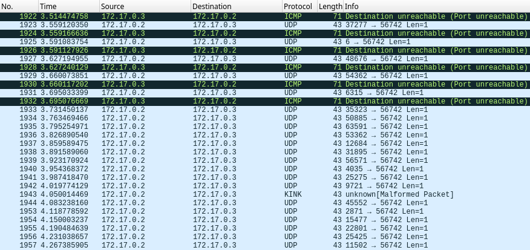
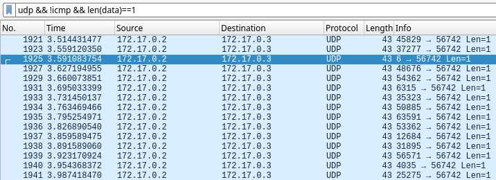
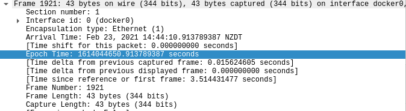
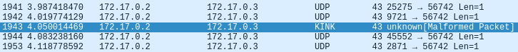
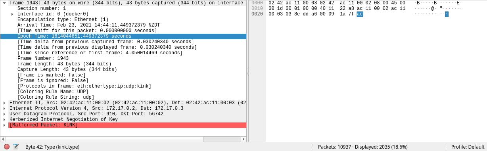

We are given two files, a packet capture, and the Python script used to scramble, encrypt and send the file over the network.

Analyzing the `send.py` script, we can see that it performs the following steps:
- Seeds `random` with the current `time`.
- Shuffles the payload with `random.shuffle`.
- Sends each byte of the payload over UDP in its own datagram. It uses `random` to generate the source port and a value to XOR with the payload.

Since the random number generated is seeded with the current time, this means if we know the time that the payload was sent, we can generate the same sequence of psuedo-random values originally used to shuffle and encrypt the payload. This will allow us to decrypt and unshuffle the data.

Taking a look at the log in Wireshark and filtering for `udp`, we see many packets being sent with a length of 1.


The ICMP responses here cause duplicate payload bytes in the output. We will need to select packets of length 1 and filter out the ICMP responses: `udp && !icmp && len(data)==1`.



Now, we need to recover the original data. In order to reverse the process we will need to seed `random` with the same time value, decrypt the payload, then unshuffle it. Inspecting the first packet, we can see the time it was sent at. We will first try to use this value as the seed.



Using tshark, I extract the source port along with the payload byte in order to verify that the state of the random number generator is correct.

`tshark -r capture.pcapng -T fields -e udp.srcport -e data 'udp && !icmp && len(data)==1' > payload.txt`

This gives us a file in the following format:
```
45829   3b
37277   04
6       79
48676   27
54362   76
...
```
*source port -> hexadecimal payload byte*

I wrote the `recover.py` script that attempts to recover the original data. If the randomly generated port does not match the extracted port, it reports where the mismatch is and fails.

When we run the script, it reports a mismatch.\
`Port mismatch on line 17, expected 910, was 45552`

This means that the random number generator correctly output 16 port values in sequence, so our seed is most likely correct. We will need to inspect the packet log further.

If we remove the length check from the Wireshark filter, it reveals extra packets that were missed. It looks like Wireshark is incorrectly decoding it as another protocol.



We can see that there is only 1 byte of data, however the field is reported as `kink.type`, so we can't extract it by specifying `data`. That's also why it didn't show up when we filtered on `len(data)==1.

To get around this, we can instruct tshark to decode these packets as raw data. Since the destination port of each packet is the same, we can specify that all UDP packets sent to that port should be decoded as raw data, with `-d udp.port==56742,data`.

With this in place, we re-extract the payload:
`tshark -r capture.pcapng -d udp.port==56742,data -T fields -e udp.srcport -e data 'udp && !icmp && len(data)==1' > data.txt`

Now when we re-run the script, there are no mismatches: `Wrote 1992 byte(s) to recovered.dat`.

Using `file` to inspect the data reveals that is is a PNG image, which contains the flag.
`recovered.dat: PNG image data, 426 x 240, 1-bit grayscale, non-interlaced`
